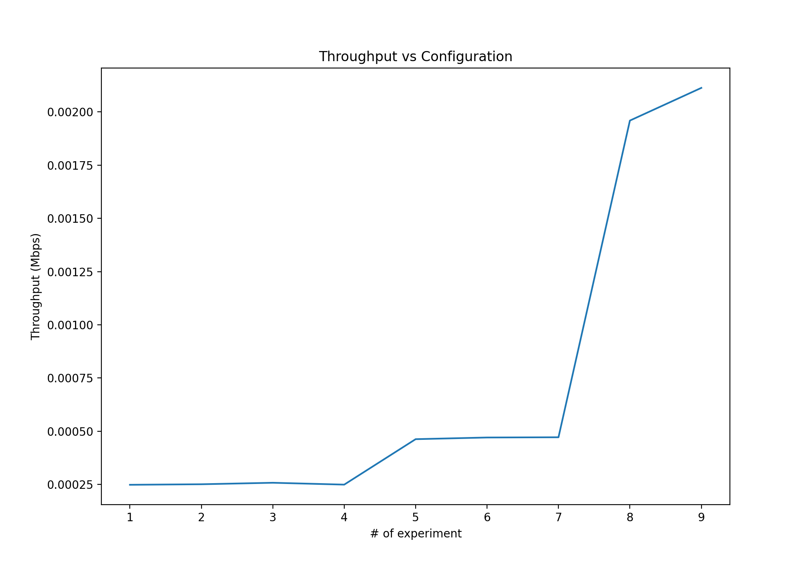
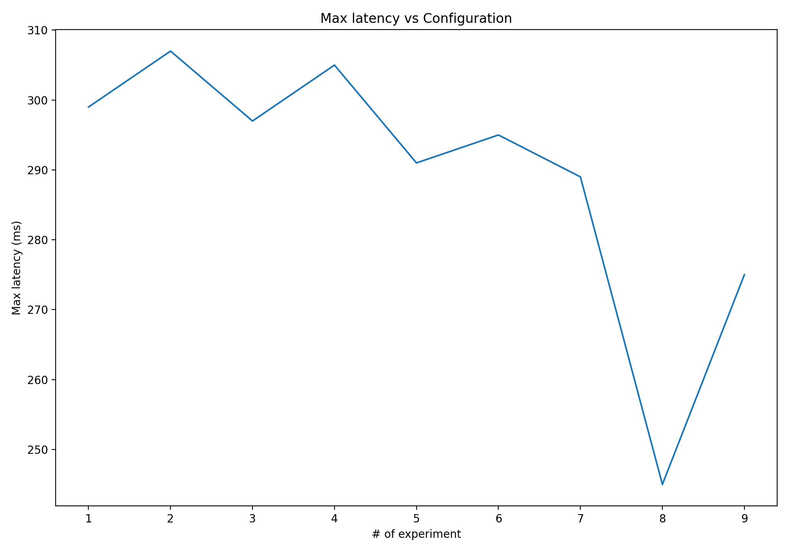

# Kafka throughput investigation

## Description

Project was implemented to investigate throughput of a kafka-based solution considering different number of producers, consumers, partitions  and replicas

Consists of following components:
- “Generator” microservice that splits the dataset to messages (reddit comments), sends them to kafka as message. 
- Microservice that receives messages (reddit comments), imitates processing by sleeping for 1 sec and saves to MongoBD message data (time when started/finished processing and message size).
- Microservice that aggregates message statistics from MongoBD and generates a report.

Experiments performed:
1. One producer, a topic with one partition, one consumer
2. One producer, a topic with one partition, 2 consumers
3. One producer, a topic with one partition, 5 consumers
4. One producer, a topic with one partition, 10 consumers
5. One producer, a topic with 2 partitions, 2 consumers
6. One producer, a topic with 2 partitions, 5 consumers
7. One producer, a topic with 2 partitions, 10 consumers
8. One producer, a topic with 10 partitions, 10 consumers
9. 2 producers, a topic with 10 partitions, 10 consumers

## Results

## How to run 
1. Have **java, docker, sbt** installed.
2. Unarchive "RC_2009-04.bz2" file (or any other file with Reddit comments from http://files.pushshift.io/reddit/comments/) to 'data' folder.
3. Run **start.sh** script.
4. To check statistics - perform HTTP GET request to http://localhost:1234/statistics.
